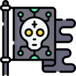

<div align="center" id="top"> 
  

&#xa0;

  <!-- <a href="https://discordbotv14.netlify.app">Demo</a> -->
</div>

<h1 align="center">FameAndFortuneBot</h1>

<p align="center">
  

  

  

  

  <!--  -->

  <!--  -->

  <!--  -->
</p>

<!-- Status -->

<!-- <h4 align="center">
	🚧  Discordbotv14 🚀 Under construction...  🚧
</h4>

<hr> -->

<p align="center">
  <a href="#dart-about">About</a> &#xa0; | &#xa0; 
  <a href="#sparkles-features">Features</a> &#xa0; | &#xa0;
  <a href="#rocket-technologies">Technologies</a> &#xa0; | &#xa0;
  <a href="#white_check_mark-requirements">Requirements</a> &#xa0; | &#xa0;
  <a href="#checkered_flag-starting">Starting</a> &#xa0; | &#xa0;
  <a href="#memo-license">License</a> &#xa0; | &#xa0;
  <a href="https://github.com/srnuvem" target="_blank">Author</a>
</p>

<br>

## :dart: About

Describe your project

## ✨ Features

:heavy_check_mark: Feature 1;\
:heavy_check_mark: Feature 2;\
:heavy_check_mark: Feature 3;

## 🚀 Technologies

The following tools were used in this project:

-   [Expo](https://expo.io/)
-   [Node.js](https://nodejs.org/en/)
-   [React](https://pt-br.reactjs.org/)
-   [React Native](https://reactnative.dev/)
-   [TypeScript](https://www.typescriptlang.org/)

## ✅ Requirements

Before starting :checkered_flag:, you need to have [Git](https://git-scm.com) and [Node](https://nodejs.org/en/) installed.

## 🏁 Starting

```bash
# Clone this project
$ git clone https://github.com/srnuvem/fameAndFortuneBot

# Access
$ cd fameAndFortuneBot

# Install NVM, Node.js and NPM
$ curl -o- https://raw.githubusercontent.com/nvm-sh/nvm/v0.39.0/install.sh | bash && source ~/.bashrc
$ nvm install 16.19.1
$ sudo apt-get install npm

# Install Dependencies
$ npm install

# Create .env file
echo BOT_TOKEN={{Your_Discord_Token}} >> .env

# Run the project
$ npm run dev

```

## 📝 License

Este projeto está licenciado sob a Licença AGPL 3.0. Consulte o arquivo [LICENSE](./LICENSE) para obter mais informações.

Made with :heart: by <a href="https://github.com/srnuvem" target="_blank">Sr. Claude</a>
Using the discord bot Handler by <a href="https://github.com/rinckonobre" target="_blank">Rincko</a>

&#xa0;

## 🎨 Arts

 <a href="https://www.flaticon.com/br/icones-gratis/cyberpunk" title="cyberpunk ícones">Cyberpunk ícones criados por Freepik - Flaticon</a> 

<a href="#top">Back to top</a>
